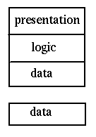
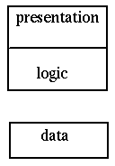
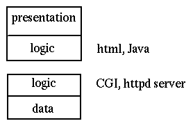
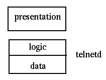
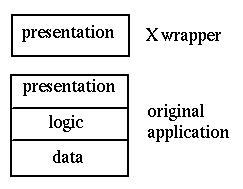
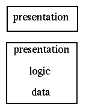
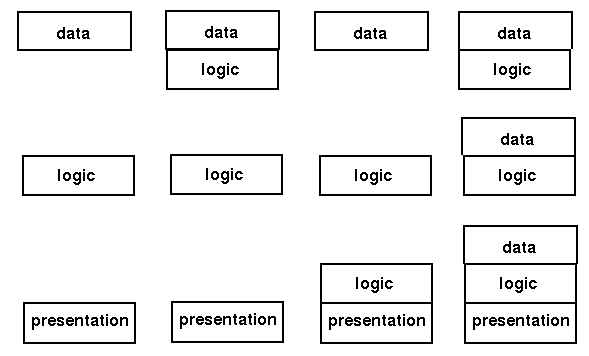

## Component Distribution

A simple but effective way of decomposing many applications is to consider them as made up of three parts:

* Presentation component
* Application logic
* Data access 

The *presentation component* is responsible for interactions with the user, both displaying data and gathering input. it may be a modern GUI interface with buttons, lists, menus, etc, or an older command-line style interface, asking questions and getting answers. The details are not important at this level.

The *application logic* is responsible for interpreting the users' responses, for applying business rules, for preparing queries and managing responses from the their component.

The *data access* component is responsible for storing and retrieving data. This will often be through a database, but not necessarily. 

### Gartner Classification

Based on this threefold decomposition of applications, Gartner considered how the components might be distributed in a client-server system. They came up with five models:

    
### Example: Distributed Database

**Gartner classification: 1**

Modern mobile phones make good examples of this: due to limited memory they may store a small part of a database locally so that they can usuall respond quickly. However, if data is required that is not held locally, then a request may be made to a remote database for that additional data.

Google maps forms another good example. Al of the maps reside on Google's servers. When one is requested by a user, the "nearby" maps are also downloaded into a small database in the browser. When the user moves the map a little bit, the extra bits required are already in the local store for quick response. 

### Example: Network File Service

**Gartner classification 2** allows remote clients access to a shared file system 

There are many examples of scuh systems: NFS, Microsoft shares, DCE, etc.

### Example: Web

An example of Gartner classification 3 is the Web with Java applets. This is a distributed hypertext system, with many additional mechanisms.

### Example: Terminal Emulation

An example of Gartner classification 4 is terminal emulation. This allows a remote system to act as a normal terminal on a local system. 

Telnet is the most common example of this. 

### Example: Expect

Expect is a novel illustration of Gartner classification 5. It acts as a wrapper around a classical system such as a command-line interface. It builds an X Window interface around this, so that the user interacts with a GUI, and the GUI in turn interacts with the command-line interface.

### Example: X Window System

The X Window System itself is an example of Gartner classification 5. An application makes GUI calls such as *DrawLine*, but these are not handled directly but instead passed to an X Window server for rendering. This decouples the application view of windowing and the display view of windowing.

### Three Tier Models

Of course, if you have two tiers, then you can have three, four, or more. Some of the three tier possibilities are shown in this diagram: 

The modern Web is a good example of the rightmost of these. The backend is made up of a database, often running stored procedures to hold some of the database logic. The middle tier is an HTTP server such as Apache running PHP scripts (or Ruby on Rails, or JSP pages, etc). This will manage some of the logic and will have data such as HTML pages stored locally. The frontend is a browser to display the pages, under the control of some Javascript. In HTML 5, the frontend may also have a local database. 

### Fat vs thin

A common labeling of components is "fat" or "thin". Fat components take up lots of memory and do complex processing. Thin components on the other hand, do little of either. There don't seem to be any "normal" size components, only fat or thin!

Fatness or thinness is a relative concept. Browsers are often labeled as thin because "all they do is display web pages". Firefox on my Linux box takes nearly 1/2 a gigabyte of memory, which I don't regard as small at all! 