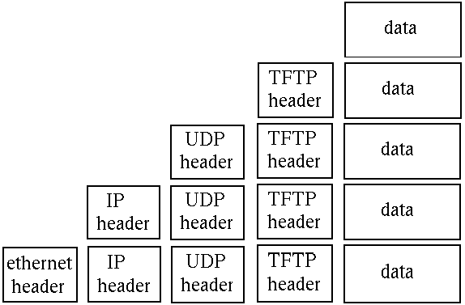

# Packet encapsulation

The communication between layers in either the OSI or the TCP/IP stacks is done by sending packets of data from one layer to the next, and then eventually across the network. Each layer has administrative information that it has to keep about its own layer. It does this by adding header information to the packet it receives from the layer above, as the packet passes down. On the receiving side, these headers are removed as the packet moves up.

For example, the TFTP (Trivial File Transfer Protocol) moves files from one computer to another. It uses the UDP protocol on top of the IP protocol, which may be sent over Ethernet. This looks like:

The packet transmitted over ethernet, is of course the bottom one.